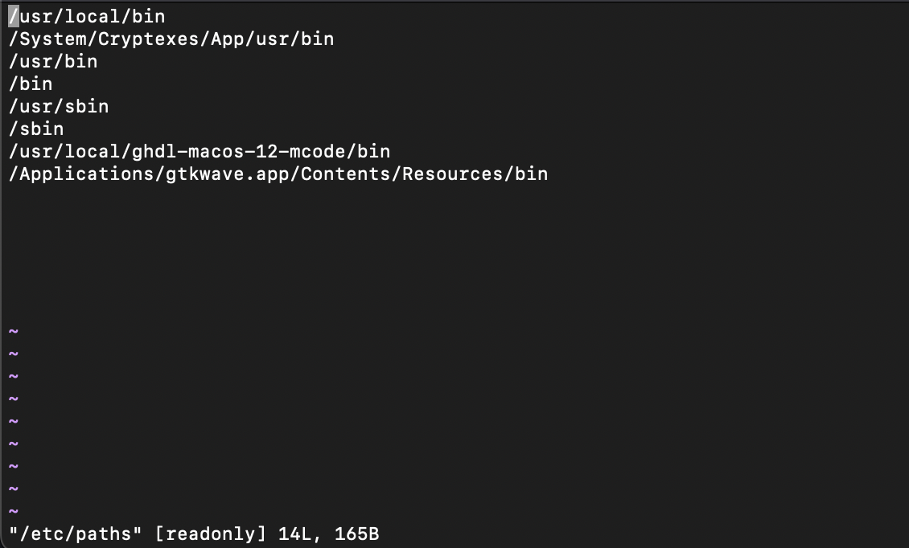
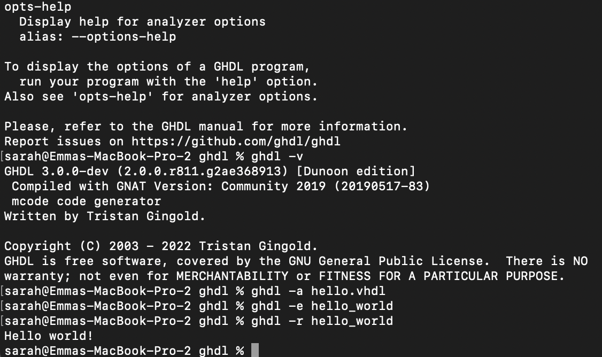
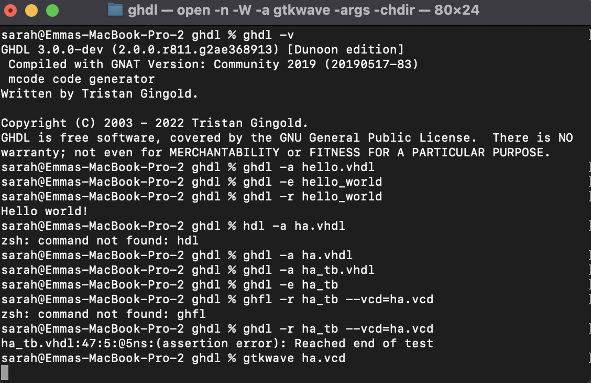
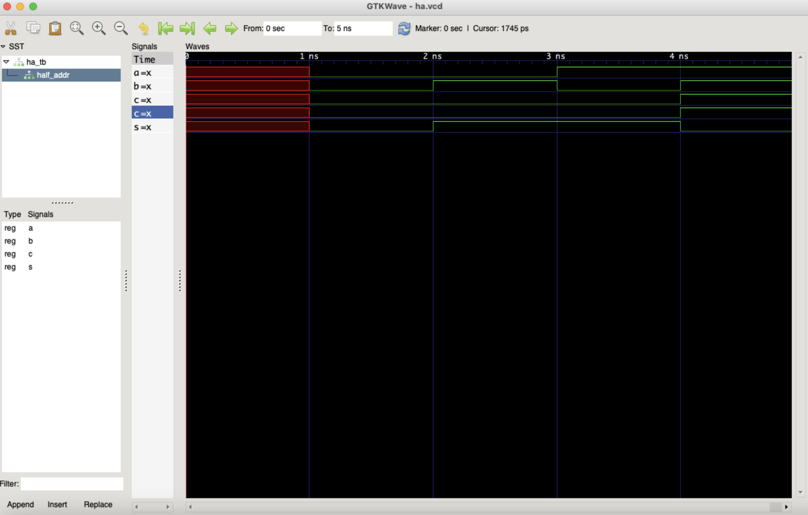
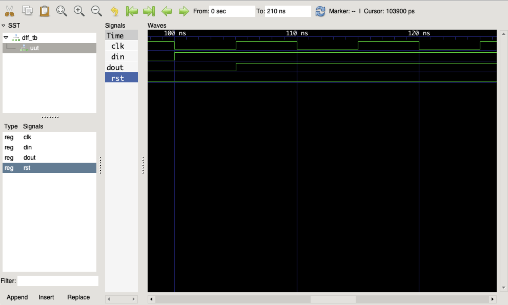

# Lab 1 — GHDL and GTKWave
#### First I downloaded GHDL and GTKWave on my mac computer based on given instructions and added lines to my PATH so it looked like the following:

#### Then I ran hello world

#### I then ran the half adder example using the following code:

#### This resulted in the following in gtkwave:

#### For the second example I ran D Flip Flop with the following code:

#### which gave the following:

