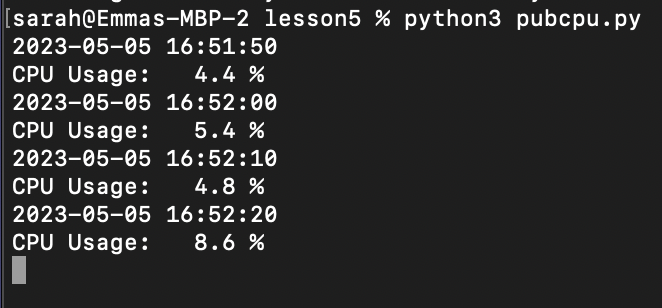
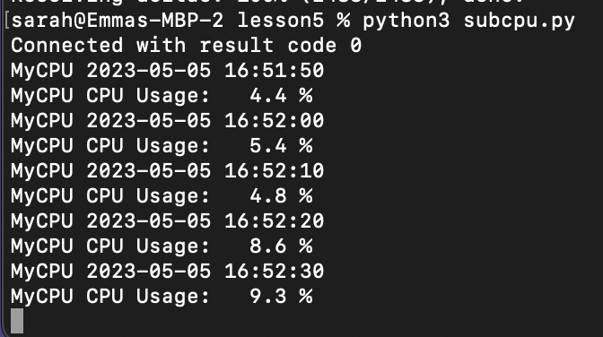

# Lab 5-Paho-MQTT

#### To start this lab I first installed Paho-MQTT, changed the directory to the iot repository, updated the repository with git pull and changed my directory to Lesson 5 using the following commands

#### % cd iot
#### % cd lesson5
#### % pip3 install -U paho-mqtt
#### % git clone https://github.com/eclipse/paho.mqtt.python.git

#### Then, in two separate terminals I ran subcpu.py and pubcpu.py and got the following:

#### pubcpu:

####subcpu:

