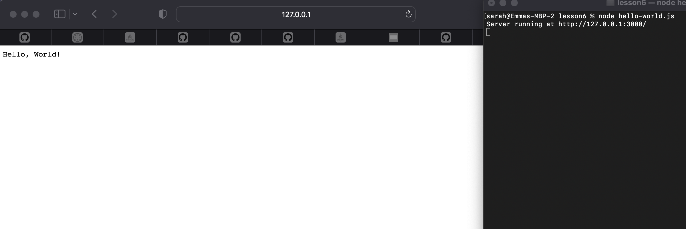

# Lab 6 - Node.js and Pystache

#### To begin lab 6 I first downloaded Node.js and pystache

#### I changed directory to lesson 6 from the iot repository and ran hello-world.js and got the following result

#### I ran hello.js

#### then https.js

#### finally i ran sayhello.py and got the following results

