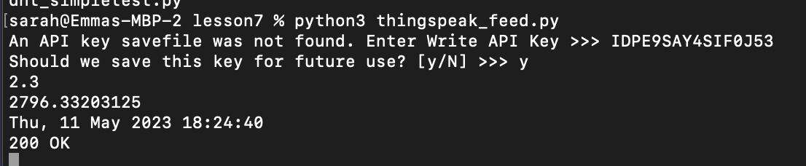

# Lab 7 - thingspeak and google sheets

#### for the first part of the lab i logged into thingspeak and created a new channel called cpu_loop with field1 cpu_pc and field2 mem_avail_mb
#### I copied the API key then ran the following in my terminal
#### % cd iot
#### % cd lesson7
#### % python3 thingspeak_feed.py
### the terminal then asked for API key which I then pasted from thingspeak and saved the key for future use

