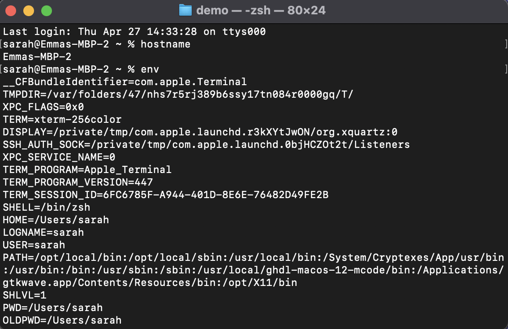
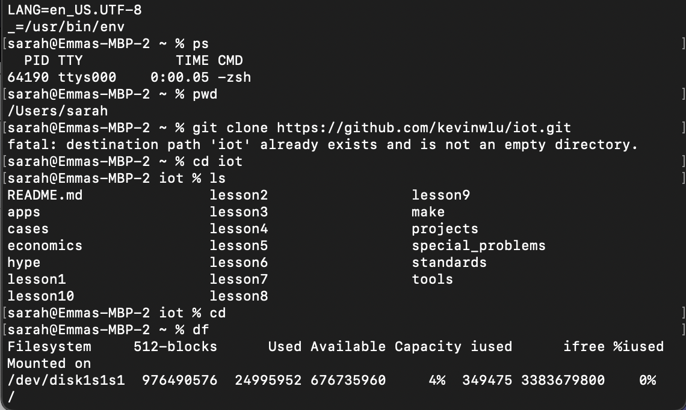
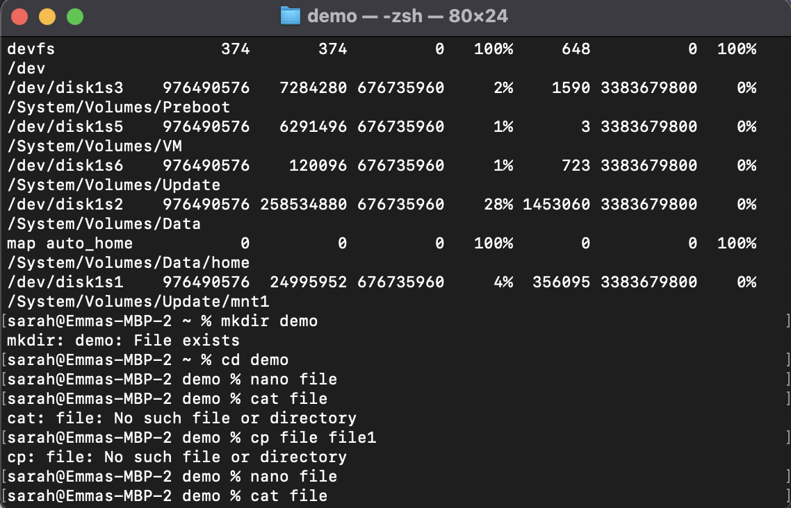
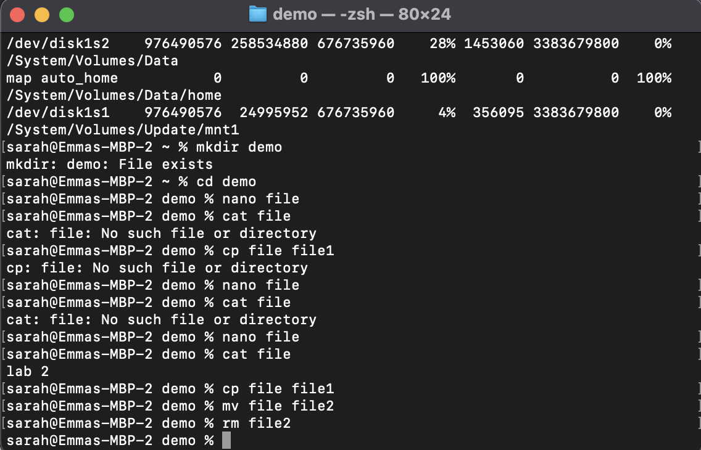
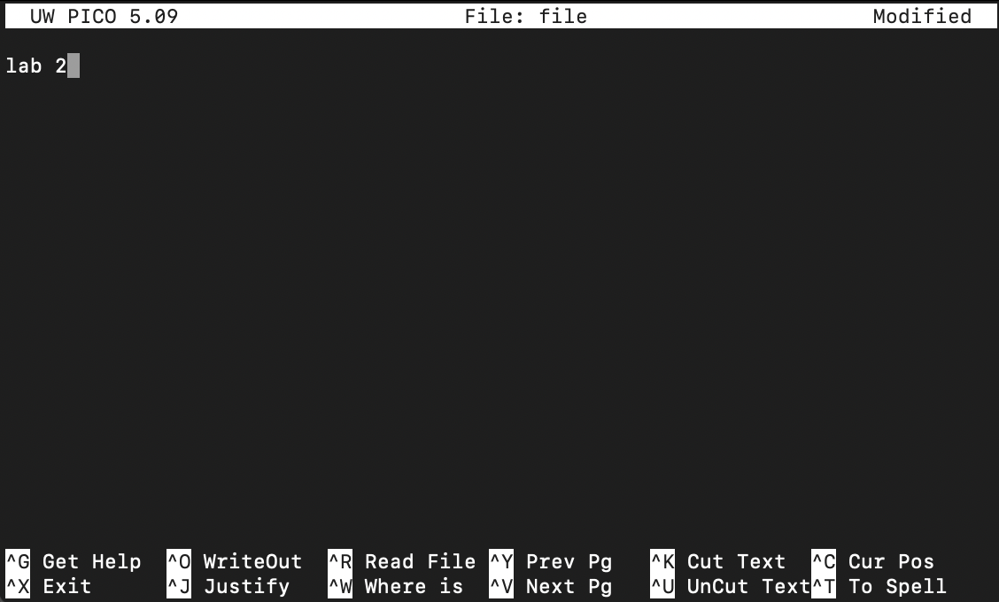
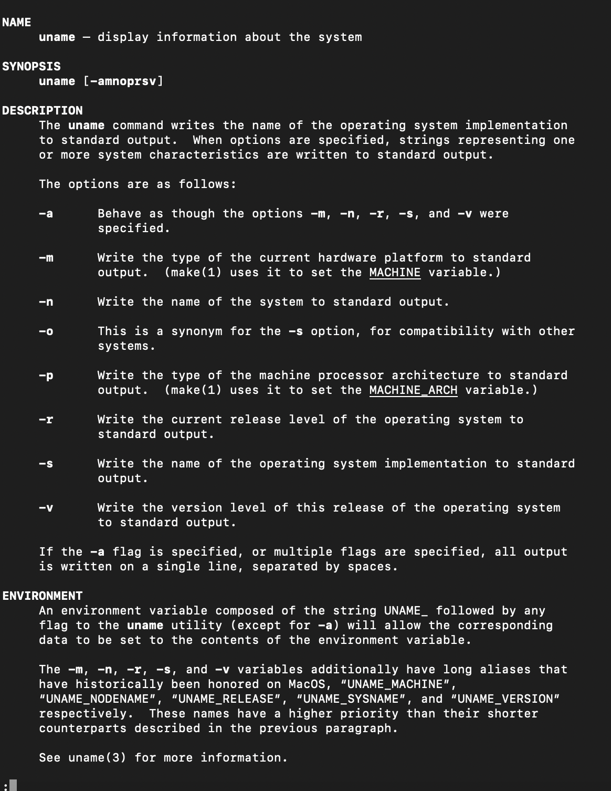

# Lab 2 - Command Line
### This lab allowed me to explore with different commands within the terminal. The following list shows the commands explored and their functions
### -1: % hostname // displays computer's host name
### -2: % env // displays computer's system variables
### -3: % ps // shows computer's active processes
### -4: % pwd // writes full path of current directory
### -5: % git clone // clones git hub repository that is linked after command into terminal
### -6: % cd // moves into diretory that follows the command
### -7: % ls // lists all files within current directory
### -8: % df // displays information about free space and space used in current file
### -9: % mkdir // creates directory with a name of whatever follows command 
### -10: % nano file // creates a file named "file" which can be edited
### -11: % cat file // prints out whatever is on "file"
### -12: % cp file file1 // copies "file" to file1
### -13: % mv file file2 // moves "file" to file2
### -14: % rm file2 // removes file2 from directory
### -15: % man uname // shows manual for uname command
### -16: % uname -a // prints system info
### -17: % ifconfig // assigns an address to a network interface and configures current network interface configuration information
### -18: % ping localhost // pings local ip address 
### -19: % netstat // shows network status 

## below shows my terminal when running the above commands

### *note the commands ifconfig, ping localhost, and netstat are not pictured as the results were too long
